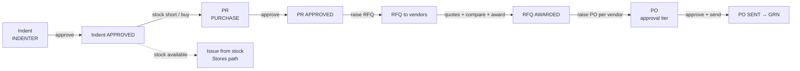

# IMPL-PURCHASE-FLOW.md — Saarlekha (Stores & Purchase)

> Implementation spec for the **canonical procurement path**:
> **Indent → PR → RFQ → PO.** Read with `AGENTS.md`, `GUARDRAILS.md`, and
> `prisma/schema.prisma`. This file is authoritative for the flow: state
> machines, line-level traceability, conversion logic, endpoints, and guards.
> The four stages are the default and are **enforced** — exceptions (rate
> contract / emergency) are explicit and flagged, never the norm.

## 1. The flow



Each hop carries a **line-level link** so any PO line can be traced back to the
originating indent line, and so "pending at stage X" reminders are exact.

```
IndentLine ──prLineId──▶ PrLine ◀──prLineId── RfqLine ──awardedQuotationLineId──▶ QuotationLine
                                                   ▲                                    │
                                          QuotationLine.rfqLineId            PoLine.quotationLineId
                                                                            (+ rfqLineId, prLineId denormalized)
```

## 2. Schema additions (merge into the `stores`/`purchase` schemas)

These traceability fields are required by this flow. Add the listed scalar +
relation fields and their reciprocal array on the parent. (`Indent`/`IndentLine`
live in schema `stores`; `PR/RFQ/PO` in `purchase`; cross-schema FKs are fine
under `multiSchema`.)

```prisma
model IndentLine {
  // ...existing...
  purchaseQty Float  @default(0)   // qty routed to purchase (vs issued from stock)
  prLineId    String?              // set on conversion; many IndentLine -> one PrLine
  prLine      PrLine? @relation(fields: [prLineId], references: [id])
  @@schema("stores")
}

model PrLine {
  // ...existing...
  indentLines IndentLine[]          // reciprocal
  rfqLines    RfqLine[]             // reciprocal
  poRaised    Boolean   @default(false)
  @@schema("purchase")
}

model RfqLine {
  // ...existing...
  prLineId              String?
  prLine                PrLine?        @relation(fields: [prLineId], references: [id])
  quotationLines        QuotationLine[]
  awardedQuotationLineId String?  @unique
  awardedQuotationLine  QuotationLine? @relation("AwardedLine", fields: [awardedQuotationLineId], references: [id])
  @@schema("purchase")
}

model QuotationLine {
  // ...existing...
  rfqLineId String?
  rfqLine   RfqLine? @relation(fields: [rfqLineId], references: [id])
  awardOf   RfqLine? @relation("AwardedLine")
  poLines   PoLine[]
  @@schema("purchase")
}

model PoLine {
  // ...existing...
  quotationLineId String?
  quotationLine   QuotationLine? @relation(fields: [quotationLineId], references: [id])
  rfqLineId       String?        // denormalized for fast trace
  prLineId        String?        // denormalized for fast trace
  @@schema("purchase")
}
```

Add an idempotency guard table so a conversion can never double-fire:

```prisma
model FlowConversion {
  id          String   @id @default(cuid())
  companyId   String
  step        String   // INDENT_TO_PR | PR_TO_RFQ | RFQ_AWARD | RFQ_TO_PO
  sourceId    String   // e.g. indentLineId / prId / rfqId
  idempotencyKey String
  createdAt   DateTime @default(now())
  @@unique([companyId, idempotencyKey])
  @@schema("purchase")
}
```

## 3. State machines (allowed transitions only)

**Indent** (`IndentStatus`)
```
DRAFT → SUBMITTED → APPROVED | REJECTED
APPROVED → PARTIALLY_ISSUED | ISSUED        (Stores: issue available qty)
APPROVED → CONVERTED_TO_PR                   (purchase: purchaseQty > 0)
(PARTIALLY_ISSUED|CONVERTED_TO_PR) → CLOSED  (all lines fulfilled)
```
A line may split: part issued from stock, `purchaseQty` routed to a PR. Indent
status is the rollup of its lines.

**PR** (`PrStatus`)
```
DRAFT → SUBMITTED → APPROVED | REJECTED
APPROVED → RFQ_ISSUED        (an RFQ covers its lines)
RFQ_ISSUED → PO_RAISED       (POs cover all lines)   [skip-RFQ exception: APPROVED → PO_RAISED]
PO_RAISED → CLOSED
```

**RFQ** (`RfqStatus`)
```
DRAFT → ISSUED → QUOTES_RECEIVED → AWARDED → CLOSED
(any non-terminal) → CLOSED        (abandoned, reason required)
```

**PO** (`PoStatus`) — unchanged from schema
```
DRAFT → PENDING_APPROVAL → APPROVED → SENT → PARTIALLY_RECEIVED → RECEIVED → CLOSED
APPROVED|SENT|PARTIALLY_RECEIVED → SHORT_CLOSED | CANCELLED
```

Every transition: server-validated source state, `companyId` from session,
wrapped in a transaction, written to `AuditLog`. Illegal transitions return 409.

## 4. Conversion logic (server actions)

All four run inside a single Prisma `$transaction`, take `companyId` from the
session, and write a `FlowConversion` row keyed by an idempotencyKey.

### 4.1 `convertIndentToPR(indentId, lineQtys[], targetPrId?)`
Pre: indent `APPROVED`; each selected line has `purchaseQty > 0` not yet converted.
```
for each selected indent line L with qty q (q ≤ L.purchaseQty - alreadyConverted):
  prLine = find-or-create PR line on targetPr (or new PR, status DRAFT) for L.itemId
  prLine.qty += q
  L.prLineId = prLine.id
assert Σ converted per line ≤ purchaseQty            // qty conservation
recompute indent status (CONVERTED_TO_PR / PARTIALLY_ISSUED)
```
A PR may aggregate lines from **multiple** approved indents (the "build PR from
pending indent lines" screen). One PR per requesting context is also allowed.

### 4.2 `submitAndApprovePR` → then `raisePrToRfq(prId, vendorIds[], prLineIds[])`
Pre: PR `APPROVED`.
```
create RFQ (DRAFT) with one RfqLine per selected PR line (RfqLine.prLineId = prLine.id)
attach vendorIds (the parties to be quoted)
set RFQ → ISSUED ; set PR → RFQ_ISSUED
```
One RFQ may pull lines from **multiple** approved PRs.

### 4.3 Quotation capture + compare + `awardRfq(rfqId, awards[])`
```
record one Quotation per vendor; QuotationLine per RfqLine (rate, disc, gst, leadDays)
on first quote in → RFQ QUOTES_RECEIVED
comparative statement: per RfqLine compute landed = rate*(1-disc)+gst(+freight share); rank
award[] = { rfqLineId, quotationLineId }   // winner per line (may differ by line/vendor)
for each award: rfqLine.awardedQuotationLineId = quotationLineId
when every RfqLine is awarded → RFQ AWARDED
```

### 4.4 `raisePoFromAward(rfqId)`
Pre: RFQ `AWARDED`.
```
group awarded RfqLines by winning vendor
for each vendor group → create one PO (DRAFT):
  for each awarded RfqLine:
    qLine = awardedQuotationLine
    PoLine{ itemId, qty=rfqLine.qty, rate=qLine.rate, discount, gstRate,
            quotationLineId=qLine.id, rfqLineId, prLineId=rfqLine.prLineId }
    mark rfqLine.prLine.poRaised = true
  PO → PENDING_APPROVAL
when all awarded lines have POs → RFQ CLOSED; affected PRs → PO_RAISED (then CLOSED when fully covered)
```
PO then follows its own machine: value-tier approval → `APPROVED` → `SENT` →
GRN (handled by the inwards flow).

## 5. Exceptions to the 4-step path (flagged, not default)

- **Rate contract / blanket PO**: items on an active blanket PO may go
  `PR → PO` directly. Requires `PrLine.fromRateContract = true` and the blanket
  PO reference; RFQ is skipped with an audited reason.
- **Emergency / direct PO**: bypasses Indent/PR/RFQ. Disabled unless
  `ReminderConfig`/company policy enables it, and always escalates to the
  **highest** approval tier. Logged as `EMERGENCY` on the PO.

Default behaviour: the system **blocks** raising a PO whose lines have no awarded
RFQ line, unless one of the above flags is set.

## 6. Endpoints / server actions

| Stage | Action | Method · Path | Role | Guard |
|------|--------|----------------|------|-------|
| Indent | create / add lines | POST `/api/indents` | INDENTER | — |
| | submit | POST `/api/indents/:id/submit` | INDENTER | status DRAFT, ≥1 line |
| | approve / reject | POST `/api/indents/:id/approve` · `/reject` | APPROVER | status SUBMITTED |
| | convert to PR | POST `/api/indents/:id/convert-to-pr` | PURCHASE | status APPROVED, purchaseQty>0 |
| PR | create from indent lines | POST `/api/prs` | PURCHASE | source lines APPROVED |
| | submit / approve | POST `/api/prs/:id/submit` · `/approve` | PURCHASE_MGR | DRAFT / SUBMITTED |
| | raise RFQ | POST `/api/prs/:id/raise-rfq` | PURCHASE | status APPROVED |
| | raise PO (skip) | POST `/api/prs/:id/raise-po` | PURCHASE_MGR | rate-contract flag |
| RFQ | issue | POST `/api/rfqs/:id/issue` | PURCHASE | status DRAFT, ≥1 vendor |
| | record quote | POST `/api/rfqs/:id/quotations` | PURCHASE | status ISSUED/QUOTES_RECEIVED |
| | award | POST `/api/rfqs/:id/award` | PURCHASE_MGR | status QUOTES_RECEIVED |
| | raise PO | POST `/api/rfqs/:id/raise-po` | PURCHASE | status AWARDED |
| PO | submit / approve / send | POST `/api/pos/:id/submit` · `/approve` · `/send` | tier-based | value-limit tier |

Every write validates the body with **zod**, derives `companyId` from session,
runs in a transaction, allocates the `PO-XXXXX`/`PR-XXXXX`/`RFQ-XXXXX`/`IND-XXXXX`
sequence atomically, and appends to `AuditLog`.

## 7. Invariants & guards

1. No PO line without an awarded RFQ line **unless** a rate-contract/emergency
   flag is set (server-enforced).
2. Qty conservation at every hop: `Σ PR.qty(from a line) ≤ Indent.purchaseQty`;
   `RfqLine.qty ≤ PrLine.qty`; `PoLine.qty = awarded qty`.
3. Conversions are **idempotent** via `FlowConversion.idempotencyKey`; a retried
   request never creates duplicate PR/RFQ/PO lines.
4. Approvals are server-checked: PR/RFQ awards by manager role; PO by value tier.
5. All status changes are legal-transition-checked; illegal → 409, no mutation.
6. No hard deletes; cancel via terminal states with an audited reason.

## 8. Reminders hooks (feeds the login engine)

- Indents `SUBMITTED` → "pending my approval"; `APPROVED` with `purchaseQty>0`
  not yet converted → "awaiting PR".
- PRs `APPROVED` with lines not on an RFQ → "awaiting RFQ".
- RFQs `ISSUED` past quote-due → "quotes pending"; `QUOTES_RECEIVED` →
  "awaiting award".
- RFQs `AWARDED` with awarded lines lacking a PO → "awaiting PO".
- POs `PENDING_APPROVAL` → "pending my approval".

## 9. Definition of done

- A PO line resolves its full ancestry: PO → Quotation → RFQ → PR → Indent
  line(s), in one query via the denormalized links.
- An approved indent's purchase qty can be converted to a PR, RFQ'd to ≥2
  vendors, awarded per line, and turned into per-vendor POs — each stage
  blocking the next until valid.
- Re-submitting any conversion is a no-op (idempotent).
- Status rolls up correctly at every level; the canonical path is enforced and
  exceptions are flagged and audited.
