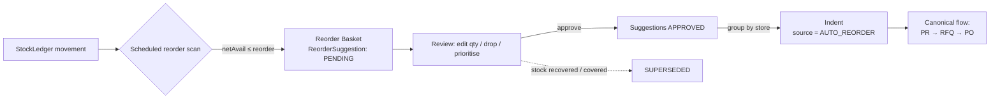

# IMPL-REORDER-REPLENISHMENT.md — Saarlekha (Stores & Purchase)

> Implementation spec for **automatic replenishment of min/reorder-level items**.
> A scheduled scan detects items at/under their reorder point, drops a
> **suggestion into a review basket**, and — after a **human approval layer** —
> converts approved suggestions into an **Indent**, which then enters the
> canonical flow in `IMPL-PURCHASE-FLOW.md` (**Indent → PR → RFQ → PO**).
> Read with `AGENTS.md`, `GUARDRAILS.md`, `prisma/schema.prisma`.
>
> Core rule: the engine **only ever creates suggestions**. It never raises an
> indent, PR, or PO on its own — a person approves the basket first (the single
> exception is an explicitly configured, value-bounded auto-approve policy, §5).

## 1. Where it sits



The basket is a **staging queue**, not an order. Approval is the gate that turns
replenishment math into a real (auditable) procurement intent.

## 2. Schema additions (schema `stores`)

```prisma
enum ReorderReason     { BELOW_REORDER  BELOW_MIN }
enum ReorderRunTrigger { CRON  MANUAL }
enum SuggestionStatus  { PENDING  REVIEWED  APPROVED  REJECTED  CONVERTED  SUPERSEDED }
enum ReorderMethod     { REORDER_TO_MAX  FIXED_QTY  EOQ }

model ReplenishmentRun {
  id          String           @id @default(cuid())
  companyId   String
  storeId     String?
  trigger     ReorderRunTrigger @default(CRON)
  scannedCount Int             @default(0)
  suggestedCount Int           @default(0)
  runAt       DateTime         @default(now())
  suggestions ReorderSuggestion[]
  @@index([companyId, runAt])
  @@schema("stores")
}

model ReorderSuggestion {
  id             String         @id @default(cuid())
  companyId      String
  runId          String?
  itemId         String
  storeId        String
  onHand         Float
  onOrder        Float          @default(0)   // open PO qty not yet received
  inPipeline     Float          @default(0)   // open indent/PR/RFQ qty not yet PO'd
  netAvailable   Float                          // onHand + onOrder + inPipeline - reserved
  reorderLevel   Float
  minStock       Float
  maxStock       Float
  suggestedQty   Float
  approvedQty    Float?
  reason         ReorderReason
  priority       String         @default("NORMAL")  // BELOW_MIN ⇒ URGENT
  preferredVendorId String?
  lastPurchasePrice Float?
  leadTimeDays   Int            @default(0)
  estValue       Float?                          // suggestedQty * lastPurchasePrice
  status         SuggestionStatus @default(PENDING)
  reviewedById   String?
  approvedById   String?
  indentId       String?                         // set on conversion
  indentLineId   String?
  createdAt      DateTime       @default(now())
  run            ReplenishmentRun? @relation(fields: [runId], references: [id])

  // one OPEN suggestion per item+store (enforce in code; partial-unique via app guard)
  @@index([companyId, status])
  @@index([companyId, itemId, storeId])
  @@schema("stores")
}

model ReorderPolicy {
  id                    String        @id @default(cuid())
  companyId             String        @unique
  enabled               Boolean       @default(true)
  scanCron              String        @default("0 * * * *")   // hourly
  method                ReorderMethod @default(REORDER_TO_MAX)
  lotRounding           Float         @default(1)             // round suggestedQty up to multiple
  autoApproveBelowValue Float?                                // null = always require review
  criticalClasses       String[]      @default(["A"])         // ABC classes that always need a human
  secondApprovalAboveValue Float?                             // optional second tier
  @@schema("stores")
}
```

Add on `Indent`: `source IndentSource @default(MANUAL)` with
`enum IndentSource { MANUAL  AUTO_REORDER }`, and an `IndentLine.reorderSuggestionId String?`
back-link for traceability.

## 3. Detection (the scan)

Runs on `ReorderPolicy.scanCron`, scoped per company per store. Stock is derived
from `StockLedger` (never a stored counter). **Net available must account for
what's already coming**, or you double-order:

```
for each active, stocked Item × Store:
  onHand     = Σ StockLedger.qty (item, store)
  onOrder    = Σ open PoLine (qty - receivedQty) for item            // APPROVED/SENT/PARTIALLY_RECEIVED
  inPipeline = Σ open IndentLine.purchaseQty (not converted)
             + Σ open PrLine.qty (not PO'd)
             + Σ open RfqLine.qty (not PO'd)
  reserved   = Σ committed-but-not-issued (open approved issues), if tracked
  netAvailable = onHand + onOrder + inPipeline - reserved

  if netAvailable <= reorderLevel:
     reason = netAvailable <= minStock ? BELOW_MIN : BELOW_REORDER
     target = method == REORDER_TO_MAX ? max(maxStock, reorderLevel)
            : method == FIXED_QTY      ? reorderLevel + fixedLot
            : eoq(item)                                              // EOQ optional
     suggestedQty = ceilToLot(target - netAvailable, lotRounding)
     if suggestedQty > 0:
        upsertSuggestion(item, store, ...)     // dedup: update the existing OPEN suggestion, don't add a 2nd
```

Dedup rule: at most **one OPEN suggestion per item+store**. A re-scan updates the
existing PENDING/REVIEWED suggestion's numbers; it never stacks duplicates.

## 4. Suggestion state machine

```
PENDING → REVIEWED        (reviewer edits qty / priority)
PENDING|REVIEWED → APPROVED
PENDING|REVIEWED → REJECTED        (with reason)
APPROVED → CONVERTED               (indent created)
(any non-terminal) → SUPERSEDED    (re-check at approve/convert: stock recovered
                                    or now covered by new on-order/pipeline)
```

Before converting, **re-evaluate `netAvailable`**. If a GRN posted or another
order now covers the shortfall, mark `SUPERSEDED` instead of creating an indent —
this is the safeguard against ordering stock you no longer need.

## 5. The approval layer

A basket suggestion needs human approval before it becomes an indent. Tiering
(all server-enforced, mirrors PO value tiers):

- **Always require a human** if the item's ABC class ∈ `criticalClasses`
  (default A-class), or `reason = BELOW_MIN` (urgent), regardless of value.
- **Auto-approve** only if `autoApproveBelowValue` is set **and** `estValue` is
  below it **and** the item is not critical — and even then the auto-approval is
  recorded with actor = `SYSTEM(reorder-policy)` and is fully audited. Default is
  `null` ⇒ everything is reviewed.
- **Second approval** (manager) required when `estValue > secondApprovalAboveValue`.

`reviewer` may edit `approvedQty`, change `priority`, set `preferredVendorId`,
split, or reject lines. Approval locks `approvedQty`.

## 6. Conversion to indent (`approveAndConvert(suggestionIds[])`)

One transaction; `companyId` from session; idempotent via `FlowConversion`
(`step = REORDER_TO_INDENT`, key = sorted suggestionIds + day).

```
re-check netAvailable per suggestion → SUPERSEDED ones are dropped
group remaining APPROVED suggestions by storeId
for each store group → create Indent {
    source = AUTO_REORDER, status = <per policy>, purpose = "Auto-replenishment",
    priority = max(line priorities)
}
  for each suggestion:
     IndentLine { itemId, qty = approvedQty, purchaseQty = approvedQty,
                  requiredBy = today + leadTimeDays, reorderSuggestionId = s.id }
     s.indentId/indentLineId set; s.status = CONVERTED
```

**Indent status on creation (policy):**
- Default `APPROVED` — the basket approval *is* the indent approval (basket
  approver recorded as indent approver). Avoids double-approving the same
  decision; the next real gate is the **PR approval**.
- Optional `SUBMITTED` — if a company wants the standard indent approval to also
  apply (set `ReorderPolicy` flag).

Because replenishment is always a buy, `purchaseQty = qty`, so the indent feeds
straight into `convertIndentToPR` (IMPL-PURCHASE-FLOW §4.1) with nothing to issue
from stock.

## 7. Endpoints / server actions

| Action | Method · Path | Role | Guard |
|--------|---------------|------|-------|
| run scan now | POST `/api/reorder/scan` | STORE_MANAGER | policy.enabled |
| list basket | GET `/api/reorder/basket` | STORE_MANAGER / PURCHASE | — |
| review / edit suggestion | PATCH `/api/reorder/suggestions/:id` | STORE_MANAGER | status PENDING/REVIEWED |
| reject | POST `/api/reorder/suggestions/:id/reject` | STORE_MANAGER | non-terminal |
| approve + convert | POST `/api/reorder/approve` | STORE_MANAGER (+ MGR tier) | status APPROVED-able |
| edit policy | PUT `/api/reorder/policy` | ADMIN | — |

zod-validate, transaction, atomic `IND-XXXXX` sequence, `AuditLog` on
scan / approve / reject / convert / auto-approve.

## 8. Guards (extend GUARDRAILS.md)

- The reorder engine **creates suggestions only**; it never raises an indent, PR,
  or PO autonomously. The sole exception is the opt-in `autoApproveBelowValue`
  policy, which is value-bounded, never applies to critical/BELOW_MIN items, and
  is audited as a SYSTEM action.
- Net-available math **must** include on-order + pipeline; ordering must not
  double-count an existing open PO/indent/PR.
- Re-check coverage at convert time; supersede rather than over-order.
- One open suggestion per item+store; re-scan updates, never duplicates.

## 9. Reminders hooks

- `N reorder suggestions pending review` (STORE_MANAGER).
- `M critical items below minimum` (BELOW_MIN, URGENT) — high severity.
- `Auto-approved replenishment indents raised today: K` (audit visibility).

## 10. Definition of done

- Dropping any item's net available to/under its reorder level produces exactly
  one PENDING suggestion with a sensible suggested qty (reorder-to-max, lot-rounded).
- A reviewer can edit, reject, or approve; approval (within tier) converts
  selected suggestions into a store-grouped `AUTO_REORDER` indent that enters the
  PR → RFQ → PO flow.
- An item already covered by an open PO/indent/PR generates **no** new suggestion;
  recovered stock supersedes a pending one.
- Every suggestion traces to its indent line and onward; every approval/auto-
  approval is audited; nothing is ordered without the approval layer.
